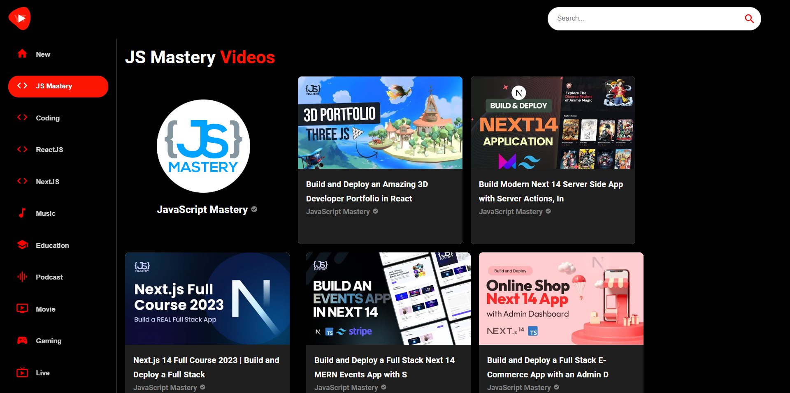

# YouTube Clone with React JS

This project is a YouTube clone created with React JS, following the tutorial from the YouTube channel [JavaScript Mastery](https://www.youtube.com/c/JavaScriptMastery). It replicates some of the core features of the YouTube platform.

## Table of Contents

- [Demo](#demo)
- [Features](#features)
- [Installation](#installation)
- [Usage](#usage)
- [License](#license)

## Demo

Try live [demo](https://abdelrahman69-youtube.netlify.app/)
<br>
<br>


## Features

List the key features of your YouTube clone, such as:

- Video playback
- Channel Browse
- Search functionality
- ...

## Installation

Before you begin, make sure you have Node.js and npm installed on your machine.

1. **Clone the repository:**

   ```bash
   git clone https://github.com/abdulrahmn69/youtube_clone_v2.git
   cd youtube_clone_v2

   ```

2. **Install dependencies:**

   ```bash
   npm install

   ```

3. **Create a .env file:**

   ```bash
   REACT_APP_API_KEY=your_youtube_api_key
   REACT_APP_BASE_URL=https://www.googleapis.com/youtube/v3

   ```

4. **Start the development server:**

   ```bash
    npm start
   ```

## Usage

Once the installation is complete, you can access the YouTube clone by visiting http://localhost:3000 in your web browser.

## License

This project is licensed under the MIT License.
